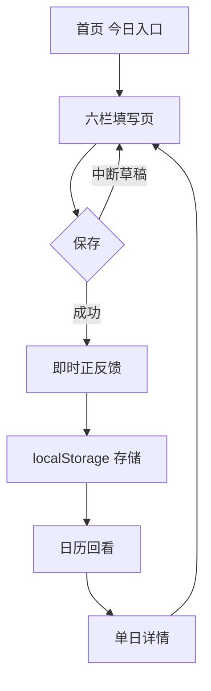

## 产品概述
将《复盘自己》产品从「微信小程序」切换为「网页端」，并以**每日记录**为第一期唯一重点，先产出网页端 MVP 方案文档与页面原型（本次不写代码）。因用户明确"我将通过看书来跟你核对"，六栏字段本期一律以【AI提炼推断】占位并标注待核对，同时单独输出一份书摘核对清单供用户翻书逐项对照。

## 核心功能
- **形态切换**：微信小程序 → 网页端（理由：小程序前置步骤过多）。采用「本地存储 localStorage + 无登录 + 无账号 + 无提醒」的最快组合跑通闭环
- **范围收敛**：原 P0 六模块收敛为第一期仅做「每日记录」，周/月复盘、成长档案、习惯提醒延后
- **第一期功能范围（用户已拍板全要）**：记（六栏引导填写）+ 存（本地存储）+ 即时正反馈（写完给"看见自己"的发现式提示）+ 日历回看（可视化记录连续性）
- **六栏字段占位**：以【AI提炼推断】给出六栏占位字段（事件/感受/想法/发现/下一步/标签），醒目标注【待用户书摘核对】，本期不锁定
- **待核对输入清单（C1-C5）**：六栏模板原始字段、每栏引导语、切分技巧落地、意义重塑话术、5分钟/时长界定。C6 打卡机制用户未勾选，本期按推断处理不核对
- **本地存储风险应对**：清缓存/换设备数据丢失 → 提供 JSON 导出/导入；无提醒 → 以日历回看的连续可视化 + 可选浏览器通知替代

## 本期明确不做
- 不写代码、不产出可运行程序（先定原型+方案，代码下一步）
- 不核对 C6 打卡机制；不推进命名（#6）、隐私社交边界（#5）保持"保留讨论"


## 技术栈选型
本期仅产出文档，以下为「代码下一步」的技术预置方案（与用户"最快跑通闭环"诉求对齐）：

- **前端**：React 18 + TypeScript + Vite（SPA）
- **样式**：Tailwind CSS + shadcn 组件（轻量引入，便于自定义温暖纸感视觉）
- **存储**：浏览器 localStorage，数据 JSON 序列化，无后端、无数据库、无账号体系
- **数据安全**：JSON 导出 / 导入（应对清缓存、换设备）
- **提醒替代**：浏览器 Notification API（可选授权，静默可拒）+ 日历回看的连续可视化（MVP 主要留存手段）

## 实现思路
纯前端单页应用，无服务端依赖，打开即用。核心策略为「分层解耦 + 存储层隔离」：将 localStorage 读写集中封装在 storage 层，六栏字段以配置项（配置驱动）集中管理，使后续用户书摘核对回来后**只改配置不改逻辑**即可锁定真实字段——这是应对"六栏字段未锁定"这一最大不确定性的关键设计决策。

## 架构与数据流
- **分层**：页面层（pages）/ 组件层（components）/ 存储层（storage）/ 领域层（types + 六栏配置）
- **数据流**：六栏填写 → 本地校验 → 写入 localStorage → 触发即时正反馈 → 日历/列表重新读取渲染



## 关键数据结构（六栏为占位，待书摘核对后仅改配置）

```typescript
// 六栏配置：集中管理，字段待用户书摘核对后替换
interface DailyRecord {
  id: string;              // UUID
  date: string;            // YYYY-MM-DD，同一天唯一
  columns: Record<string, string>; // 键由六栏配置驱动，值为用户输入
  createdAt: number;
  updatedAt: number;
  isDraft: boolean;        // 支持中断草稿，体现"中断友好"原则
}
```

## 目录结构

```
d:/gitlab/self_review/
└── output/
    ├── 复盘产品-网页端MVP方案_v1.0_0902.md        # [NEW] 形态切换后的网页端 MVP 方案主文档：范围收敛说明、localStorage 方案与风险应对（导出/导入）、无提醒替代策略、六栏推断占位、待确认项更新
    ├── 复盘产品-网页端页面原型_v1.0_0902.md       # [NEW] 页面原型文档：5 个页面清单、每页区块线框结构说明、页面间交互流与跳转关系、异常/空态说明
    └── 复盘产品-待书摘核对清单_0902.md            # [NEW] C1-C5 书摘核对清单：逐项列出需要从书中摘录的内容、当前推断值、核对后回填位置，供用户翻书对照后反馈
```


## 设计风格
温暖纸感自然主义（Warm Paper Naturalism）。以米白纸感底 + 深青绿主色 + 暖琥珀点缀，营造"翻开一本好笔记本"的静谧仪式感，呼应"发现式复盘"非批判、轻盈、有收获感的内核。柔和阴影、大留白、圆角卡片，配轻微渐显与卡片浮起微动效；避免冷硬的企业蓝与任何警示性红色，让界面"不催促、不评判"。

## 页面规划

### 1. 首页（今日记录入口）
- **顶部问候栏**：居中日期 + 温和问候语（如"今天，看见自己"），右下角设置图标。
- **今日状态卡**：大圆角纸感卡片，显示今日是否已记录；未记录显示引导按钮"开始今天的复盘"，已记录显示"已记录，去回看"。
- **连续记录条**：柔和进度条 + 天数，文案"已记录 X 天"，断签不显示惩罚性提示。
- **快捷入口区**：两个并排卡片"补记昨天""回看日历"。
- **底部导航**：首页 / 日历 / 我的，选中态用主色描边。

### 2. 每日记录填写页（六栏）
- **顶部进度栏**：标题"每日记录" + 返回 + 六栏进度点（已完成栏变主色）。
- **六栏表单区**：每栏一个卡片，含栏目标题（待书摘核对，现占位）、灰色占位引导语、自适应文本域。
- **底部操作条**：固定"保存"主按钮 + 草稿提示"没写完也没关系，先存草稿"。
- **沉浸处理**：聚焦当前栏时其余栏降低透明度，减少心理负担。

### 3. 即时正反馈页（保存后）
- **发现卡**：顶部柔和渐显卡片，用"我发现了…"句式呈现用户本条记录中的正向发现，非评判语气。
- **金色收获条**：暖琥珀色细条，显示本次记录沉淀的关键词标签。
- **鼓励语**：一句温和肯定（如"又多看见了自己一点"），配轻微上浮动效。
- **底部行动区**："继续补记""查看日历"两个次级按钮，主色弱化为文字按钮。

### 4. 历史回看日历页
- **月份切换栏**：居中年月 + 左右箭头，柔和切换动效。
- **月历网格**：有记录日期填充主色圆点，密集度越高色阶越深，无记录日期留空白（不标记缺失）。
- **本月概览条**：显示本月记录天数与高频关键词，语气温和中性。
- **底部导航**：与其他主页面保持一致。

### 5. 单日记录详情页
- **日期标题栏**：大号日期 + 星期，返回按钮。
- **六栏只读卡**：按六栏顺序纵向排列，每栏标题 + 用户内容，纸感卡片。
- **当日发现条**：若该日有正反馈记录，以暖琥珀细条置顶展示。
- **底部操作**：编辑 / 删除（删除需二次确认，语气温和）。
