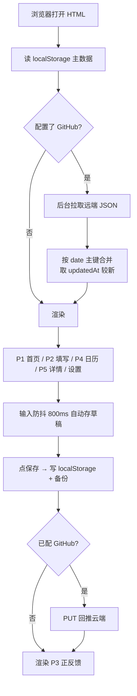

## 产品概述

《复盘自己》个人复盘产品第一期：把书中「每日复盘」方法论做成一个打开浏览器就能用的网页端 MVP。沿用用户已有 todolist 产品的工程范式（单文件 HTML + localStorage + GitHub 云同步），但代码从零编写，业务按书摘核对后的真实 8 栏结构实现。

## 核心特征

### 一、每日记录（8 栏，已由书摘核对锁定）

分两步呈现，桌面端左右两栏、窄屏自动降为单列：

**第一步 · 记录**
1. ① 事件（必填）——只写客观事实，运用「切分」，不写主观感受与价值判断
2. ② 当时的想法和感受（必填）——写真心话，配情绪轮盘辅助选词
3. ③ 行动（可空）
4. ④ 结果（可空）

**第二步 · 意义重塑**
5. ①-A 重新注意到了什么（必填）——换自己/对方/第三者视角
6. ② 从现在开始可以采取的行动（可空）——再运用一次「切分」，只写仅靠自己能做到的
7. ③ 这些行动可能会带来怎样的结果（可空）

**延伸 · ①-B 对自己的新发现（可空，默认折叠）**——附三个引导问题

### 二、配套功能

- 情绪轮盘：普鲁奇克 8 主情绪 × 3 强度，可点选追加到②栏
- 即时正反馈：保存后给"我发现了…"发现卡，规则化提取、绝不编造
- 日历回看：月历色阶呈现记录密度，空白日期不标记缺失
- 单日详情：只读卡展示（空栏不展示）、编辑、删除二次确认
- 数据导出/导入 JSON、GitHub 云同步（多设备）

### 三、视觉基调

温暖纸感自然主义：米白纸感底 + 深青绿主色 + 暖琥珀点缀，营造"翻开一本好笔记本"的静谧仪式感。界面不催促、不评判，避免企业蓝与警示性红色。


## 技术栈选型

沿用用户已有 todolist 的工程范式，但**不复用其代码**：

| 层 | 选型 | 理由 |
|---|---|---|
| 形态 | 单文件 HTML（HTML+CSS+JS 全内联） | 零依赖、零构建，双击即用；与 todolist 一致的使用体验 |
| 存储 | localStorage（4 个 key） | 无登录、无后端，打开即用 |
| 云同步 | GitHub Contents API（GET/PUT JSON） | 用户明确要求"仿照 todo 用 GitHub 同步"，实现多设备 |
| 样式 | 原生 CSS（CSS 变量令牌） | 单文件场景不需要 Tailwind 构建链 |
| 图形 | 内联 SVG（情绪轮盘） | 无第三方图表库依赖 |

## 实现思路

### 核心决策一：8 栏配置驱动

把 8 个栏位抽成 `FIELDS` 配置数组（含 key、编号、标题、引导问题、提示、必填标记、切分检测开关）。渲染、详情、导出全部遍历配置生成，未来改栏位名称/顺序/增删**只改配置不动逻辑**。

```js
var FIELDS = [
  { step:1, no:'①', key:'event', label:'事件', guide:'什么事件让你内心有所触动？',
    required:true, placeholder:'只写发生的客观事实…', splitCheck:'fact' },
  { step:1, no:'②', key:'thoughts', label:'当时的想法和感受', guide:'事件发生时你的想法和感受是什么？',
    required:true, placeholder:'写真心话，不必顾虑…', emotionWheel:true },
  { step:1, no:'③', key:'action', label:'行动', guide:'当时你采取了什么行动？', required:false },
  { step:1, no:'④', key:'result', label:'结果', guide:'当时的行动带来了什么结果？', required:false },
  { step:2, no:'①-A', key:'reframe', label:'重新注意到了什么', guide:'回顾事件及左侧所写内容后，你重新注意到了什么？',
    required:true, tip:'可以站在自己的角度、对方的角度，甚至第三者的角度重新审视。' },
  { step:2, no:'②', key:'nextAction', label:'从现在开始可以采取的行动', guide:'从现在开始，你可以采取什么具体行动？',
    required:false, splitCheck:'self' },
  { step:2, no:'③', key:'nextResult', label:'这些行动可能会带来的结果', guide:'这些行动可能会带来怎样的结果？',
    required:false, tip:'即使看似"什么都没有发生"，那也是结果的一种，请如实记录。' },
  { step:2, no:'①-B', key:'selfDiscovery', label:'对自己的新发现', guide:'是否有关于自己的新发现？',
    required:false, collapsible:true,
    prompts:['我的心中为什么会产生那样的想法？','那一刻，我真正渴望的是什么？','是否还存在其他可选方式？'] }
];
```

### 核心决策二：切分技巧落到两处实时提示

用户输入时做**规则化检测**，只温和提示、不阻断、不强制：

- `event` 栏（fact 模式）：命中「我觉得/我感到/我认为/很糟糕/不应该/太/真是/居然/竟然/开心/难过/生气/害怕/担心/失望/遗憾/后悔」等主观词 → 提示"这看起来是感受或判断，可以挪到『当时的想法和感受』，让这一栏只留客观事实"
- `nextAction` 栏（self 模式）：命中「希望对方/让他/让她/取得信任/别人/他会/她会/对方能/大家能」等依赖他人表述 → 提示"这件事能否实现取决于对方，试试改成『我计划…』『我将尝试…』？"

### 核心决策三：正反馈规则化，绝不编造

按优先级提取用户自己写下的文字：①-B 自我发现 → ①-A 意义重塑 → 兜底中性鼓励语（"你记录下了今天"）。**不生成任何用户没写过的推断与评价**——虚假正反馈会摧毁"发现式复盘"的信任基础。

### 核心决策四：GitHub token 不硬编码

todolist 把 token 硬编码进 HTML（存在文件公开后的泄露风险）。本实现改为**设置页输入、存 localStorage、不写入代码**，并在设置页提示"此 token 仅保存在你的浏览器本地"。

## 数据模型

```js
// 一天一条记录，date 为主键
{
  id: number,
  date: 'YYYY-MM-DD',
  event: '', thoughts: '', emotions: [], action: '', result: '',
  reframe: '', nextAction: '', nextResult: '', selfDiscovery: '',
  isDraft: true,
  createdAt: number, updatedAt: number
}
```

localStorage key：
- `review_records`（主数据）
- `review_backup`（上一次成功保存的备份，支持"恢复备份"）
- `review_prefs`（主题、上次查看月份等偏好）
- `review_github`（同步配置：token/owner/repo/path/branch）

## 架构设计



渲染沿用 todolist 的**全量重渲染**模式（`render()` 重建 innerHTML + 全局 `W` 对象挂载事件），但**输入过程不触发全量渲染**——`textarea` 的 `oninput` 只更新数据 + 防抖存草稿 + 局部更新该栏提示元素，避免光标丢失与输入卡顿。

## 目录结构

```
d:/gitlab/self_review/output/
└── 复盘自己_0902.html   # [MODIFY] 单文件 MVP（当前 0 字节，需完整写入）
                          #   §1 CSS：设计令牌、明暗主题、响应式布局、动效
                          #   §2 FIELDS 配置 + EMOTION_WHEEL 数据
                          #   §3 存储层：localStorage 读写/备份 + GitHub GET/PUT
                          #   §4 渲染层：P1 首页、P2 填写、P3 正反馈、P4 日历、P5 详情、设置页
                          #   §5 业务逻辑：切分检测、情绪轮盘 SVG、正反馈提取、日历色阶
                          #   §6 全局 W 对象 + 键盘快捷键 + 初始化
```

配套已存在文档（本次只读参考，不改）：`复盘产品-网页端MVP方案_v1.0_0902.md`、`复盘产品-网页端页面原型_v1.0_0902.md`。

## 实现要点（防回归）

- **XSS 防护**：所有用户输入回显必须经 `escapeHtml()`，包括导入的 JSON 内容
- **光标保持**：`textarea` 输入不触发全量 `render()`，仅局部更新提示节点
- **UTF-8 Base64**：GitHub PUT 用 `TextEncoder` + `btoa`，不用已废弃的 `unescape/encodeURIComponent` 组合
- **合并策略**：远端与本地按 `date` 主键合并，取 `updatedAt` 较新者；本地独有的保留
- **中断友好**：日历空白日期纯空白不标记；"已记录 N 天"不做断签对比；删除二次确认文案温和（"再想想 / 确认删除"，不用红色）
- **同步失败静默**：GitHub 拉取/推送失败只在本机 toast 温和提示，不阻断本地使用
- **空栏不展示**：详情页跳过未填写的栏位，避免"这里没填"的隐性指责

## 相对 todolist 的改进点

| 项 | todolist 现状 | 本实现 |
|---|---|---|
| token | 硬编码在 HTML 中 | 设置页输入、存 localStorage、不进代码 |
| 输入体验 | 全量 render 可能丢焦点 | 输入不触发全量渲染 |
| Base64 | `unescape(encodeURIComponent())` 已废弃 | `TextEncoder` + `btoa` |
| 编码 | — | 全量 `escapeHtml` 转义 |


## 设计风格

温暖纸感自然主义。以米白纸感底 + 深青绿主色 + 暖琥珀点缀，营造"翻开一本好笔记本"的静谧仪式感，呼应"发现式复盘"非批判、轻盈、有收获感的内核。

**设计铁律：界面不催促、不评判。** 避免冷硬的企业蓝与任何警示性红色；柔和阴影、大留白、圆角卡片；轻微渐显与卡片浮起微动效。

## 页面结构与区块

### P1 首页
- 顶部问候栏：居中日期 + 温和问候语（按时段微调晨/午/晚）+ 右下设置图标
- 今日状态卡：大圆角纸感卡片，未记录显示"从今天开始，看见自己"+ 引导按钮；已记录显示"已记录，去回看"（主色浅描边，不用对比色施压）
- 连续记录条：柔和进度条 + "已记录 X 天"，断签不显示任何惩罚性提示
- 快捷入口：并排两卡"补记昨天 / 看昨天的记录"、"回看日历"

### P2 每日记录填写页
- 顶部进度栏：返回箭头 + 标题 + 8 个进度点（已填变主色，不显示百分比）
- 表单区：桌面端左右两栏（第一步左 / 第二步右，复刻书中版式）；窄屏（<900px）自动降为单列顺序排列
- 每栏卡片：编号 + 标题 + 灰色引导语 + 自适应文本域；聚焦该栏时其余栏降至 40% 透明度
- 情绪轮盘：② 栏内折叠入口，展开为 SVG 轮盘（8 主情绪 × 3 强度），点击把情绪词追加到输入区
- ①-B 默认折叠，展开后显示三个引导问题
- 底部操作条：主按钮"保存" + 草稿提示"没写完也没关系，先存草稿"

### P3 即时正反馈页
- 发现卡：柔和渐显 + 上浮，"我发现了…"句式
- 金色收获条：暖琥珀细条展示本次情绪/关键词
- 鼓励语："又多看见了自己一点"，轻微上浮动效
- 底部行动区："继续补记""查看日历"两个次级文字按钮

### P4 日历回看页
- 月份切换栏：居中年月 + 左右箭头，不可切到未来月份
- 月历网格：有记录日期填充主色圆点，充实度越高色阶越深；**无记录日期纯空白，不标记缺失**
- 本月概览条："这个月，你有 X 天记录了自己"，温和中性，不做缺失对比

### P5 单日详情页
- 日期标题栏：大号日期 + 星期 + 返回
- 当日发现条：暖琥珀细条置顶展示该日发现（无则隐藏）
- 栏位只读卡：按 8 栏顺序排列，**空栏不展示**
- 底部操作：编辑 / 删除（二次确认，文案温和）

### 设置页
- GitHub 同步配置（token / 仓库 / 路径 / 分支 + 测试连接 + 立即同步）
- JSON 导出 / 导入 / 恢复备份 / 下载备份文件
- 已用容量显示、明暗主题切换

