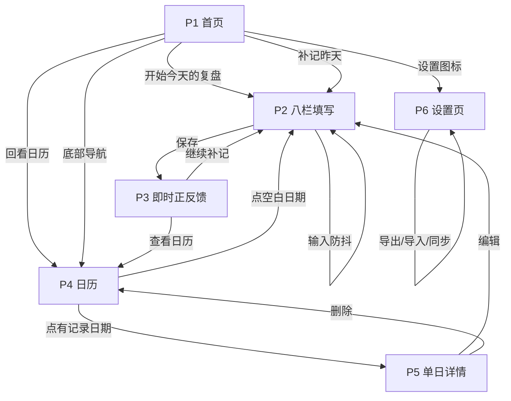

# 《复盘自己》网页端页面原型（第一期：每日记录）

- **版本**：v1.3
- **日期**：2026-09-02（v1.3 更新 2026-09-03）
- **配套文档**：《复盘产品-网页端MVP方案_v1.1_0902.md》《复盘产品-待书摘核对清单_0902.md》
- **对应产物**：`output/复盘自己_0902.html`（本文档已按书中八栏原文 + 用户三个布局决策重建）
- **说明**：本文档定义 6 个页面的结构、区块、交互流与异常态，作为实现依据

---

## 0. 设计基调

### 视觉风格：温暖纸感自然主义

以米白纸感底 + 深青绿主色 + 暖琥珀点缀，营造"翻开一本好笔记本"的静谧仪式感，呼应"发现式复盘"非批判、轻盈、有收获感的内核。

**设计铁律**：界面**不催促、不评判**。
- 避免冷硬的企业蓝与任何警示性红色；
- 柔和阴影、大留白、圆角卡片；
- 轻微渐显与卡片浮起微动效。

### 色彩令牌（v1.3 分级重建）

**中性色阶**（取代原先笼统的三色）：

| 令牌 | 浅色 | 深色 | 用途 |
|---|---|---|---|
| `--ink-900` | `#1F1D1B` | `#F5F1EA` | 大标题、强调数字 |
| `--ink-800` | `#2C2A28` | `#E9E4DA` | 正文 |
| `--ink-700` | `#423E39` | `#CFC8BC` | 次级正文 |
| `--ink-600` | `#565149` | `#B4ACA0` | 说明文字 |
| `--ink-500` | `#6E6860` | `#989086` | 次级信息 |
| `--ink-400` | `#8C847A` | `#7E776D` | 弱化文字 / 占位符 |
| `--ink-300` | `#A9A196` | `#645E55` | 禁用态 / 图标 |
| `--ink-200` | `#C7BFB4` | `#4A453E` | 分隔线 / 进度槽 |

**纸面**：`--paper #FBF9F5` / `--paper-2 #F5F1EA` / `--paper-3 #EEE9E0` / `--surface #FFFFFF`

**主色（深青绿）**：`--pri #2E6B5B` / `--pri-600 #255A4C`（hover） / `--pri-400 #4A8C7A`（边框） / `--pri-050 #EAF2F0`（浅底）

**点缀色（收获/发现）**：`--acc #BE8B30`
> 由 v1.0 的 `#D9A441` **降饱和**而来——原色偏土黄，在白底上显脏；降饱和后仍是暖意，但更耐看、与深青绿更协调。

**深色模式**：独立调校中性色阶与阴影（不做简单反色——反色会让阴影失效、对比度失衡）。

### 间距：8px 基准网格

`--sp-1` 4 · `--sp-2` 8 · `--sp-3` 12 · `--sp-4` 16 · `--sp-5` 24 · `--sp-6` 32 · `--sp-7` 48

### 字体

| 层级 | 令牌 | 字号 | 字重 |
|---|---|---|---|
| 超大标题 | `--fs-2xl` | `clamp(26px,3.6vw,34px)` | 600 |
| 大标题 | `--fs-xl` | `clamp(20px,2.4vw,23px)` | 600 |
| 小标题 | `--fs-lg` | 18px | 600 |
| 正文强调 | `--fs-md` | 16px | 500 |
| 正文 | `--fs-base` | 15px | 400 |
| 辅助 | `--fs-sm` | 13px | 400 |
| 弱化 | `--fs-xs` | 12px | 400-500 |

字体族：PingFang SC → Hiragino Sans GB → Microsoft YaHei → system-ui。标题用 `clamp()` 流体字号，小屏自动收窄。

### 圆角与阴影

| 令牌 | 值 | 用途 |
|---|---|---|
| `--r-xs` / `--r-sm` | 8 / 10 | 标签、输入框 |
| `--r` / `--r-md` | 14 / 18 | 卡片 |
| `--r-lg` | 24 | 正反馈卡、弹层 |
| 按钮 | 999 | 胶囊 |

阴影 4 级（`--shadow-xs` → `--shadow-lg`），均为极低透明度的双层阴影，模拟纸面轻浮而非"投影盒"。**卡片默认仅用 `--shadow-xs`**，hover 才升到 `--shadow-md`。

### 动效

- 统一缓动 `--ease: cubic-bezier(.22,.9,.3,1)`；
- 进场 `fadeUp` 0.5s，交互反馈 0.22-0.28s；
- 动效只服务两件事：**表明从哪来**（位移渐显）、**表明可点击**（hover 反馈）；
- `prefers-reduced-motion` 下全部关闭。

### 无障碍与细节

- 正文对比度 ≥4.5:1（中性色按明度分级保证）；
- `:focus-visible` 键盘焦点环（2px 主色描边 + 2px 偏移）；
- 桌面端自定义滚动条（细、圆角、hover 加深）；
- 阅读型页面正文宽度 **760px**（约 42 字/行），记录页两栏保持 1120px。

---

## 1. 页面清单

| # | 页面 | 职责 |
|---|---|---|
| P1 | 首页（今日记录入口） | 今日状态、连续天数、快捷入口 |
| P2 | 每日记录填写页（**八栏·左右两栏**） | 八栏引导填写、草稿、切分提示、情绪轮盘 |
| P3 | 即时正反馈页 | 保存后的发现式反馈 |
| P4 | 历史回看日历页 | 月历色阶、记录密度、进详情 |
| P5 | 单日记录详情页 | 查看/编辑/删除 |
| P6 | 设置与数据页 | JSON 导出/导入、GitHub 同步配置、容量显示 |

---

## 2. P1 首页（今日记录入口）

### 区块结构

```
┌─────────────────────────────────┐
│  [顶部问候栏]                    │
│     9月2日 星期三                 │
│     今天，看见自己                │
└─────────────────────────────────┘
┌─────────────────────────────────┐
│  [今日状态卡]                    │
│   今天还没有记录                 │
│   ┌───────────────────────┐    │
│   │   开始今天的复盘   →   │    │
│   └───────────────────────┘    │
└─────────────────────────────────┘
┌─────────────────────────────────┐
│  [连续记录条]                    │
│  ▓▓▓▓▓▓▓▓░░░░  已记录 8 天       │
└─────────────────────────────────┘
┌──────────────┬──────────────────┐
│ [补记昨天]   │ [回看日历]        │
└──────────────┴──────────────────┘
┌─────────────────────────────────┐
│  [底部导航]  首页 │ 日历 │ 我的   │
└─────────────────────────────────┘
```

### 区块说明

| 区块 | 内容 | 规则 |
|---|---|---|
| 顶部问候栏 | 居中日期 + 温和问候语（"今天，看见自己"），右下角设置图标 | 问候语按时段微调（晨/午/晚），语气始终温和 |
| 今日状态卡 | 大圆角纸感卡片。未记录 → "开始今天的复盘"；已记录 → "今天已经记录了，去回看" | 已记录态用主色浅 `#4A8C7A` 描边，不用对比色施压 |
| 连续记录条 | 柔和进度条 + 天数，文案"已记录 X 天" | **断签不显示任何惩罚性提示**；中断后从 1 重新开始，无提示、无红字 |
| 快捷入口区 | "补记昨天""回看日历" | 若昨天已记录，"补记昨天"改为"看昨天的记录" |
| 底部导航 | 首页 / 日历 / 我的 | 固定定位；**P2 / P3 页隐藏导航**（底部有操作条，避免遮挡） |

### 异常/空态

- **首次进入（无任何记录）**：状态卡文案改为"从今天开始，看见自己"；连续记录条隐藏；快捷入口仅保留"回看日历"（置灰，附"还没有记录"）。
- **未开启备份/同步**：首页顶部可关闭轻提示（非弹窗）："你的记录存在本机，建议开启 GitHub 同步或导出备份一次"。
- **今天已满 3 条**：首页不出现"再记一条"入口，文案"今天写下 3 条了，够好了"；**不弹错、不红色警告**。
- **建了新条目但没写字就离开**：离开记录页时自动清理空条目，不留空壳。

---

## 3. P2 每日记录填写页（八栏 · 左右两栏）

### 3.0 一天不限条数

同一天可记录任意多件触动自己的事，每条独立走完八栏。**不设上限**。

```
【首页】今天已经记下 5 条
        还有别的触动你的事，也可以写下来。一天记多少条都行。
        [去回看]  [再记一条（第 6 条）]

【记录页】‹  今天第 3 条 · 共 5 条  ›      ← 多条时可左右切换

【详情页】──── 第 1 条 ────
          …八栏内容…
          [编辑这条] [删除这条]
          ──── 第 2 条 ────
          …八栏内容…
          [编辑这条] [删除这条]
          [这天再记一条（第 6 条）]

【月历】 多条的日子：圆点下方显示小角标「5」
【清单】 按日期倒序分组，逐条列出，点击直达编辑
```

> **为什么取消上限**：3 条是上一版自行加的约束，书中并无此限制。"不催促、不评判"也要求产品不去规定"今天写得够多了"。

### 3.1 版式（用户拍板：左右两栏，复刻书中版式）

```
┌──────────────────────────────────────────────────────┐
│  ←  每日记录                        ●●○○○○○○○○        │ [顶部进度栏]
├──────────────────────────────────────────────────────┤
│          ‹   今天第 2 条 · 共 2 条   ›                 │ [条目指示·可切换]
├─────────────────────────┬────────────────────────────┤
│  第一步 · 记录           │  第二步 · 意义重塑          │
│ ┌─────────────────────┐ │ ┌────────────────────────┐ │
│ │ ① 事件        【必填】│ │ │ ①-A 重新注意到了什么    │ │
│ │ 什么事件让你内心     │ │ │            【必填】     │ │
│ │ 有所触动？           │ │ │ 回顾事件及左侧所写内容  │ │
│ │ ┌─────────────────┐ │ │ │ 后，你重新注意到了什么？│ │
│ │ │                 │ │ │ │ ┌──────────────────┐  │ │
│ │ └─────────────────┘ │ │ │ │                  │  │ │
│ │ ⓘ 只写客观事实…     │ │ │ └──────────────────┘  │ │
│ └─────────────────────┘ │ └────────────────────────┘ │
│ ┌─────────────────────┐ │ ┌────────────────────────┐ │
│ │ ② 当时的想法和感受   │ │ │ ② 从现在开始可以采取    │ │
│ │          【必填】    │ │ │    的行动              │ │
│ │ 事件发生时，你的想法 │ │ │ 你可以采取什么具体行动？│ │
│ │ 和感受是什么？       │ │ │ ┌──────────────────┐  │ │
│ │ ┌─────────────────┐ │ │ │ │                  │  │ │
│ │ └─────────────────┘ │ │ │ └──────────────────┘  │ │
│ │ 不知道怎么表达？     │ │ │ ⓘ 只写仅靠自己能做到的 │ │
│ │ 看看情绪轮盘  ⌄      │ │ └────────────────────────┘ │
│ └─────────────────────┘ │ ┌────────────────────────┐ │
│ ┌─────────────────────┐ │ │ ③ 这些行动可能会带来    │ │
│ │ ③ 行动              │ │ │    怎样的结果          │ │
│ │ 当时你采取了什么行动？│ │ │ ⓘ 什么都没发生也是结果 │ │
│ └─────────────────────┘ │ └────────────────────────┘ │
│ ┌─────────────────────┐ │ ┌────────────────────────┐ │
│ │ ④ 结果              │ │ │ ①-B 对自己的新发现      │ │
│ │ 当时的行动带来了     │ │ │ 是否有对自己的新发现？  │ │
│ │ 什么结果？           │ │ │ · 为什么产生那样的想法？│ │
│ └─────────────────────┘ │ │ · 真正渴望的是什么？    │ │
│                         │ │ · 还有其他可选方式吗？  │ │
│                         │ │ （常驻展开，不折叠）     │ │
│                         │ └────────────────────────┘ │
├─────────────────────────┴────────────────────────────┤
│  ┌────────────────────────────────────────────────┐  │
│  │                    保  存                       │  │
│  └────────────────────────────────────────────────┘  │
│            保存，再记一条                              │ ← 未满 3 条时
│  没写完也没关系，随时可以离开——已经自动存好了          │
└──────────────────────────────────────────────────────┘
```

> 满 3 条时，"保存，再记一条"替换为一行弱化文字"今天已经写下 3 条了"。

### 3.2 响应式

- **视口 ≥900px**：严格左右两栏（左=第一步 4 栏，右=第二步 3 栏 + ①-B），复刻书中版式。
- **视口 <900px**：自动降为单列，顺序为 ①②③④ → ①-A ②③ → ①-B。**内容结构不变，仅排列变化**。

### 3.3 区块说明

| 区块 | 内容 | 规则 |
|---|---|---|
| 顶部进度栏 | 标题"每日记录" + 返回箭头 + **八栏进度点** | 已填写的栏位进度点变主色 `#2F6F5E`；仅作温和提示，不显示百分比、不催促 |
| **条目指示条** | "今天第 N 条 · 共 M 条"，多条时左右箭头切换 | 首条隐藏左箭头、末条隐藏右箭头（置灰不可点）；切换前自动落盘草稿 |
| 底部"保存，再记一条" | 保存当前条并立即新建一条 | 未满 3 条时显示；已满则替换为弱化文字 |
| 八栏表单区 | 每栏一个纸感卡片：编号 + 标题 + 必填标记 + 灰色引导提问 + 自适应文本域 | 引导提问为【原文】，逐字采用 |
| **切分提示位** | ①栏下方（事实切分）、⑥栏下方（自己能做到的切分） | 命中时**温和浅色小字**出现，不拦截、不判错、不阻止保存 |
| **情绪轮盘入口** | ②栏卡片底部低调文字链接"不知道怎么表达？看看情绪轮盘" | 默认收起；点开展开内联面板，再点收起 |
| 底部操作条 | "保存"主按钮 + 草稿提示"没写完也没关系，先存草稿" | 固定定位 |

### 3.4 情绪轮盘面板（用户拍板：可查看、可收起）

- **定位**：查阅辅助工具，不打断写作。用户不知道怎么表达情绪时才打开。
- **形态**：内联 SVG 轮盘，普鲁奇克 8 主情绪 × 3 强度 = **24 个情绪词**。
- **交互**：点击某色块 → 该情绪词**追加进②栏输入框**并记为情绪标签 → 面板保持展开（可连点多个）→ 点入口再收起。
- **收起态**：仅一行弱化文字链接，视觉权重最低。

### 3.5 切分实时检测规则

| 检测栏 | 触发词示例 | 提示文案 | 语气 |
|---|---|---|---|
| ① 事件 | 我觉得、很糟糕、太过分、居然、竟然、他总是、不应该 | "这更像是你的感受，可以挪到②栏去" | 浅色小字，可忽略 |
| ⑥ 行动 | 希望对方、他应该、取得信任、期待他、让他 | "这取决于对方。试试改成『我计划…』『我将尝试…』" | 浅色小字，可忽略 |

> **不误报要求**：纯客观叙述（"部门成员在工作中出现了失误。"）不触发任何提示。规则词表保守，宁可漏报不可误报。

### 3.6 关键交互

- **沉浸处理**：聚焦某一栏时，其余七栏降至 40% 透明度。
- **自动草稿**：输入防抖即时写入 localStorage；已保存过的记录被编辑时同样即时落盘。
- **保存校验**：① / ② / ①-A 三栏均有内容才可保存；全空时按钮置灰（`cursor: not-allowed`）。
- **文本域**：原生 `<textarea>`，自适应高度，覆盖默认边框/背景/outline 以匹配纸感风格。

### 3.7 异常/空态

- **编辑已有记录**：回填该日内容，标题改为"编辑记录"，保存按钮文案"保存修改"。
- **草稿恢复**：存在草稿时进入，顶部温和提示条"上次没写完，已为你保留"，2 秒后自动淡出（不打断、不强制）。

---

## 4. P3 即时正反馈页（保存后）

### 区块结构

```
┌─────────────────────────────────┐
│      [发现卡 · 柔和渐显]         │
│   ┌───────────────────────┐    │
│   │  我发现了…              │    │
│   │  "我在意的是被认真对待"  │    │
│   └───────────────────────┘    │
│                                 │
│  ─────────────────────────────  │ [金色收获条]
│  #愤怒  #不安                   │
│                                 │
│      又多看见了自己一点          │ [鼓励语]
│                                 │
│   继续补记        查看日历       │ [底部行动区]
└─────────────────────────────────┘
```

### 正反馈生成规则（三级回退，绝不编造）

| 优先级 | 来源 | 句式 |
|---|---|---|
| 1 | **①-B 对自己的新发现** 有内容 | "我发现了：…" |
| 2 | ①-B 空 → **①-A 重新注意到了什么** 有内容 | "我重新注意到：…" |
| 3 | 两者皆空 | 中性兜底"你记录下了今天" |

> **铁律**：内容**全部取自用户自己写下的文字**，不改写、不升华、不生成用户没写过的洞察。宁可反馈平淡，不可编造。
> 用户写"我很难过"，产品绝不会改写成"这是成长的契机"（【原文】不勉强正向思考）。

### 其余区块

| 区块 | 规则 |
|---|---|
| 金色收获条 | 暖琥珀 `#D9A441` 细条，显示②栏点选的情绪标签；无标签时整条隐藏 |
| 鼓励语 | 一句温和肯定，配轻微上浮动效；不夸张 |
| 底部行动区 | "继续补记""查看日历"，弱化为文字按钮 |

### 交互

- 进入时卡片轻微渐显 + 上浮；
- "继续补记" → 返回 P2 编辑当日；"查看日历" → P4；浏览器返回键 → 回 P1（不重复弹反馈）。

---

## 5. P4 回看页（月历 / 清单 双视图）

### 5.1 公共头部

```
┌─────────────────────────────────┐
│   ‹    2026 年 9 月    ›         │ [月份切换栏]
├─────────────────────────────────┤
│      ┌────────┬────────┐        │
│      │  月历  │  清单  │        │ [分段控件]
│      └────────┴────────┘        │
└─────────────────────────────────┘
```

| 区块 | 规则 |
|---|---|
| 月份切换栏 | 居中年月 + 左右箭头；不可切换到未来月份 |
| 分段控件 | "月历 / 清单"二选一，选中态白底 + 轻阴影；切换不重载数据，仅换渲染方式 |

### 5.2 月历视图

```
┌─────────────────────────────────┐
│   一  二  三  四  五  六  日      │
│                    1   2   3     │ [月历网格]
│    4   5   6   7   8   9  10     │
│   ...                            │
├─────────────────────────────────┤
│  这个月，你有 12 天记录了自己     │ [本月概览条]
└─────────────────────────────────┘
```

| 区块 | 规则 |
|---|---|
| 月历网格 | 有记录的日期填充主色圆点，内容越充实色阶越深；**无记录日期留纯空白，不标记缺失、不显示叉号** |
| 条数角标 | 当天 >1 条时，圆点下方显示数字 |
| 本月概览条 | 语气温和中性；**不做"缺了几天"的对比** |

### 5.3 清单视图（v1.3 新增）

```
┌───────────────────────────────────────┐
│  9 月 3 日   星期三            3 条   │ [日期分组头]
├───────────────────────────────────────┤
│  ①  例会上方案被临时改了，我当场…      │ [条目]
│     写了 8 栏 · #不安 #烦恼        ›   │
├───────────────────────────────────────┤
│  ②  同事主动帮我补了数据              │
│     写了 5 栏 · #欣喜              ›   │
├───────────────────────────────────────┤
│  ③  还没写完的一条                    │
│     草稿 · 写了 2 栏               ›   │
├───────────────────────────────────────┤
│  9 月 2 日   星期二            1 条   │
├───────────────────────────────────────┤
│  ①  晚上孩子画了幅画给我              │
│     写了 6 栏 · #温暖              ›   │
├───────────────────────────────────────┤
│  这个月，你有 12 天、共 28 条记录      │ [概览]
└───────────────────────────────────────┘
```

**分组规则**：

- 按**日期倒序**分组（最近的在最上面），组内按创建顺序编号；
- 只显示**当前月**的记录，跨月严格过滤；
- 只列**有内容**的条目，空白条目不留壳。

**单条结构**：

| 元素 | 内容 | 规则 |
|---|---|---|
| 序号 | 圆形序号 ①②③ | 该条在当天中的顺序，主色浅底 |
| 标题 | 条目摘要 | **优先取 ① 事件栏**；为空则回退 ①-A，再依次取第一个有内容的栏；全空显示"（还没写内容）"；超 2 行省略 |
| 元信息 | "写了 N 栏" + 情绪标签 + 草稿标记 | 草稿标签用琥珀色区分；情绪标签最多 3 个 |
| 箭头 | `›` | 暗示可进入；hover 变主色并右移 2px |

**交互**：

- 点击任一条目 → 进入 P2 编辑**该条**（按 id 全局定位日期，跨月也能正确跳转）；
- hover 整行：浅底 + 边框 + 右移 2px。

**空态**：整月无记录 → "这个月还没有记录／写下第一件事，就算开始了"，**不显示任何催促或缺失标记**。

### 5.4 色阶规则

| 当日记录情况 | 视觉 |
|---|---|
| 无记录 | 空白，无任何标记 |
| 1 条（仅 3 栏必填） | 主色 40% 透明度圆点 |
| 1 条（含可空栏） | 主色 80% 透明度圆点 |
| **多条** | 圆点 + 下方小角标显示条数（>1 时） |
| 今日 | 主色细边框 + 数字加粗 |

### 5.5 交互与空态

- **月历视图**：点有记录日期 → P5；点无记录日期 → P2 补记（日期预填）；点未来日期 → 不可点。
- **清单视图**：点任一条目 → P2 编辑该条（跨月自动定位日期）。
- **整月无记录**：两视图均显示空态"这个月还没有记录，随时可以开始"，**不显示任何催促或缺失标记**。

---

## 6. P5 单日记录详情页

```
┌─────────────────────────────────┐
│  ←   9 月 2 日 星期三             │ [日期标题栏]
├─────────────────────────────────┤
│  ─────────────────────────────  │ [当日发现条]
│  我发现了：在意被认真对待         │
├─────────────────────────────────┤
│  ┌───────────────────────────┐  │
│  │ ① 事件                    │  │ [八栏只读卡]
│  │ 今天会上被临时改了方案…    │  │ 空栏不展示
│  ├───────────────────────────┤  │
│  │ ② 当时的想法和感受        │  │
│  │ 有点失落，也有点生气       │  │
│  ├───────────────────────────┤  │
│  │ ①-A 重新注意到了什么      │  │
│  │ …                          │  │
│  └───────────────────────────┘  │
├─────────────────────────────────┤
│         编  辑       删  除       │ [底部操作]
└─────────────────────────────────┘
```

| 区块 | 规则 |
|---|---|
| 日期标题栏 | 大号日期 + 星期 + **当天条数**（"· 3 条"）+ 返回按钮 |
| **条目分隔条** | 多条时以"第 N 条"细线分隔标题分段；单条时不显示 |
| 当日发现条 | 每条各按 P3 规则提取，暖琥珀细条置顶；无则隐藏 |
| 八栏只读卡 | 按八栏顺序纵向排列；**空栏不展示**，避免"这里没填"的隐性指责 |
| 底部操作 | 每条各自"编辑这条 / 删除这条"；页面底部另有"这天再记一条" |

- **删除二次确认**：文案随条数变化——当天仅 1 条时"确定要删掉这一天的记录吗？"，多条时"确定要删掉这一条吗？"。按钮"再想想 / 确认删除"，**不使用红色警示**，"再想想"为默认焦点。
- 删除后：当天仍有条目 → 停留详情页；当天已空 → 返回 P4，日历对应日期圆点消失。

---

## 7. P6 设置与数据页

```
┌─────────────────────────────────┐
│  ←   设置                        │
├─────────────────────────────────┤
│  数据备份                        │
│  ┌──────────┬──────────┐       │
│  │ 导出 JSON│ 导入 JSON│       │
│  └──────────┴──────────┘       │
│  已用 12 KB / 约 5 MB            │
├─────────────────────────────────┤
│  GITHUB 云同步                   │
│  Token    [__________]          │
│  用户名   [__________]          │
│  仓库名   [__________]          │
│  文件路径 [__________]          │
│  ┌──────────┬──────────┐       │
│  │ 测试连接 │ 立即同步 │       │
│  └──────────┴──────────┘       │
├─────────────────────────────────┤
│  外观                            │
│  [ 浅色 ]  [ 深色 ]              │
└─────────────────────────────────┘
```

| 区块 | 规则 |
|---|---|
| 数据备份 | 导出全量 JSON 下载；导入按 `date` 合并，冲突取 `updatedAt` 较新 |
| 容量显示 | 显示已用容量；接近上限提示导出归档 |
| GitHub 云同步 | **token 只在本地输入保存，不写进文件**；测试连接验证可读写；立即同步手动触发 |
| 外观 | 明暗主题切换 |

**同步机制**：启动时 GET 拉取远端 JSON → 与本地按 `date` 合并（取 `updatedAt` 较新）→ 保存后 PUT 回推。推送遇 409（sha 冲突）自动"先拉再推"一次；其它错误提示不重试。

---

## 8. 页面交互流



### 状态流转

| 触发 | 从 | 到 | 数据变化 |
|---|---|---|---|
| 首次进入 | — | P1 | 读 localStorage；若配了同步则先拉取远端 |
| 点击开始记录 | P1 | P2 | 创建/读取当日记录（`isDraft: true`） |
| 输入内容 | P2 | P2 | 防抖写入 localStorage（含已保存记录的编辑） |
| 点击保存 | P2 | P3 | `isDraft: false`，写 `updatedAt`，触发云推送 |
| 查看历史 | P4 | P5 | 按 `date` 读取 |
| 编辑 | P5 | P2 | 回填八栏 |
| 删除 | P5 | P4 | 移除该日记录，写备份层 |
| 导出 | P6 | — | 全量记录 → JSON 下载 |
| 导入 | P6 | — | JSON → 按 `date` 合并，冲突取较新 |

---

## 9. 全局异常与边界

| 场景 | 处理 |
|---|---|
| localStorage 不可用（无痕模式） | 顶部温和提示"当前浏览器无法保存记录，换普通模式即可保存"，功能仍可试用 |
| 存储接近上限 | 设置页显示容量；达 80% 提示"建议导出归档" |
| 云同步失败 | toast 温和提示原因；409 自动重试一次；其它错误不静默吞错 |
| 导入 JSON 格式错误 | 温和提示"这个文件读不出来，换一个备份文件试试"，不报技术错误码 |
| 用户输入回显 | 全量 `escapeHtml` 转义 |
| 删除后撤销 | MVP 不做撤销（依赖二次确认兜底） |

---

## 10. 实现与本文档的偏差说明

| 项 | 本文档 | 实际实现 | 说明 |
|---|---|---|---|
| 云同步 | 二期评估 | **已实现** | 用户 0902 拍板"仿照 todo 用 GitHub 同步" |
| 记录粒度 | 一天 1 条 | **一天不限条数** | 用户 0903 明确"不是限制 3 条"；同步主键随之从 `date` 改为条目 `id` |
| 回看方式 | 仅月历 | **月历 / 清单 双视图** | 用户 0903 要求"可以按清单列出来" |
| 视觉 | 初版样式 | **设计系统级重做** | 用户 0903 要求对齐资深设计师水准；详见 §0 令牌体系 |
| 情绪轮盘 | v1.0 未涉及 | **已实现**（可收起面板） | 用户 0902 拍板 |
| 浏览器通知 | P2 可选 | **未实现** | 授权本身即打扰，与"不催促"冲突 |
| 技术栈 | 未指定 | 单文件 HTML | 借鉴用户 todolist 范式 |

---

*原型文档；八栏结构、切分两处、情绪轮盘形态均按书中原文与用户 0902 拍板结果锁定。*
